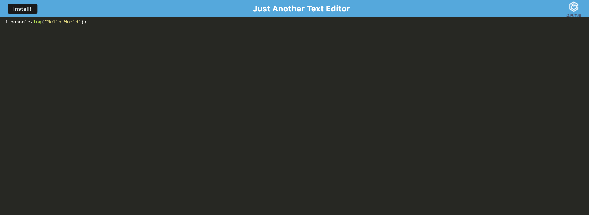

# edit-dat-txt
An awesome text editor that runs in the browser.

## Live Deployed Link

## Description
A browser-based text editor. This app is a single-page application that satisfies PWA requirements. It includes a number of data persistence strategies that act as backups in the event that one of the alternatives is not supported by the browser. The application can also be used offline.

## Screenshot of Live Application

## Table of Contents
* [Installation](#installation)
* [Dependencies](#dependencies)
* [Usage](#usage)
* [Contributors](#contributors)
* [Testing](#testing)
* [Questions](#questions)

## Installation
To install this project, clone this repository on Github and open it in your personal IDE. 

To update your package.json file accordingly, run `npm install`. This will install all necessary dependancies since they are all included within the package.json file.

## Dependencies 
Webpack.config.js, Heroku 

## Usage
After cloning this repository in your preferred IDE, navigate to the running application by clicking the live deployed link at the top of this Github page. Begin modifying your text after you've landed on the page! If you are visiting this application while offline, navigate to the Heroku deployed link and click the "install" button in the top left corner of the page to get started.

## Contributors 
Starter code provided by edX in partnership with the University of Washington. Thank you to askBCS for assisting in debugging my webpack.config.js file to successfully run.

## License

This project is licensed under the [MIT](https://opensource.org/license/mit/) license. 

## Questions
If you have questions, please send them [here](mailto:marleysue@gmail.com?subject=[GitHub]%20Dev%20Connect) or visit [github/marleyschneiderr](https://github.com/marleyschneiderr).

